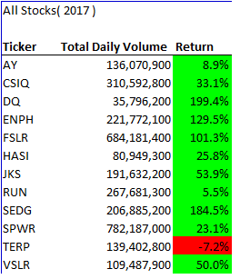
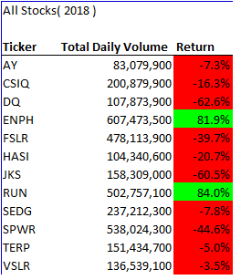
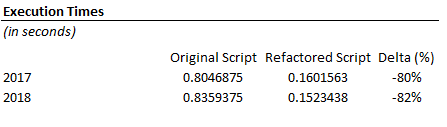

Stock-analysis

    Overview of Project

    Steve is conducting a research on stocks to help his parents addressing its wealth management planning. We have developed an algorithm in VBA to help him analyze thousands of stocks, furthermore we have improved our algorithm to reduce the time it takes to execute.
        
    Purpose

    To  refactor our initial stock analysis code to make the VBA script run faster.

    Results
    
    2017 stock performance was fairly positive with a weighted average (by total daily volume) return of 60.4% and only one company had a negative return. Below please find the returns for 2017.

    2018 stock performance was way worse than 2017 with a weighted average (by total daily volume) return of 7.1% and only two companies with positive returns. Below please find the returns for 2018.

    In regards to the VBA Script time execution, the refactored script is ~80% faster vs. the original script. Below please find a detailed comparison

   Summary

   The advantages of refactoring a code are material, if the refactoring is done correctly there can be a material reduction in time execution. However, potential disadvantages may be reflected in the time it takes to refactor the code, which could be timely if we are not familiar with the design pattern. 
   
   Regarding the VBA Script of this project, by refactoring the code we obtained the great advantage of reducing the time execution by ~80%. The only minor disadvantage was the time it took me to refactor the code.
    
